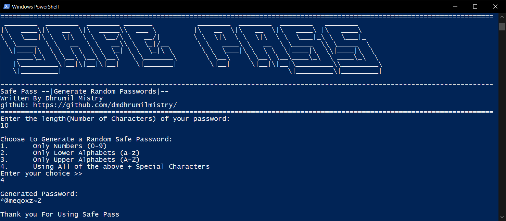

# SafePass

SafePass helps to create Random Passwords with different combinations of special characters, alphabets and numbers.

For running the SafePass on the system, make sure you have jvm or jdk installed.

One can download the builds from the build folder and run using command prompt or terminal. Use "java -jar [filename].jar" to run using terminal directly after downloading the jar file from the builds folder.
 
For proper operation, User is preferred to compile the source files on their system.

# Steps to compile the program:
1. Download or clone the repository on the system.
2. Open terminal or cmd in src folder.
3. Use "javac Main.java" to compile the program.
4. Use "java Main" to run the program.

# How to Use:
1. Open Command Prompt, PowerShell or Terminal.

2. Compile the Program if not compiled before, using "javac Main.java".

3. Run the program using "java Main" command.

4. Enter the length of the password you would like to create.

5. A menu will appear. Choose option of your choice. Enter the valid option number (1, 2, ...)

6. Password will be generated.

7. Copy and Use the password

# Currently Working to create a Password Manager for SafePass
The future updates will include the Password Manager.
